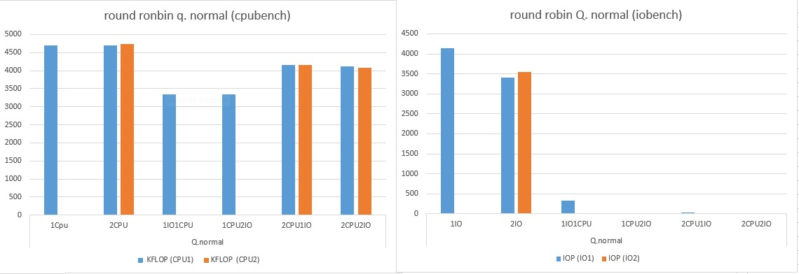
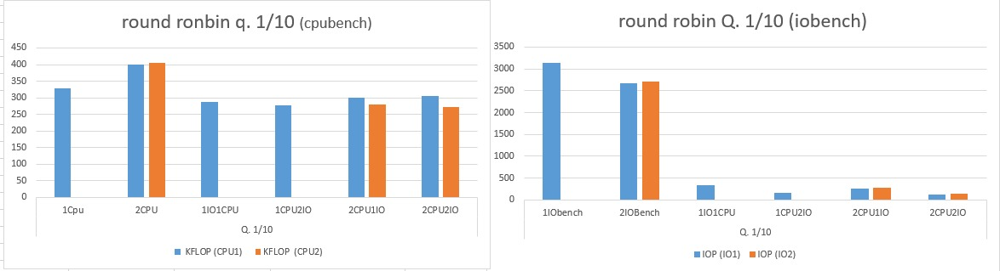
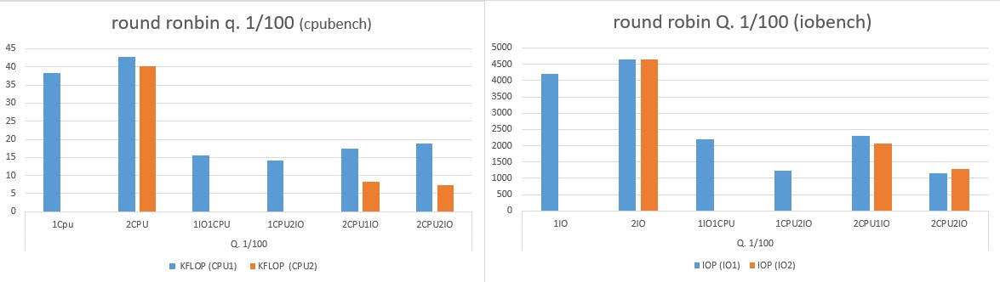
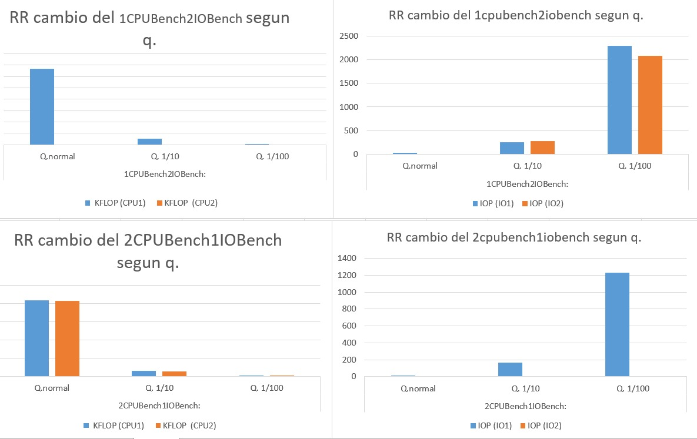
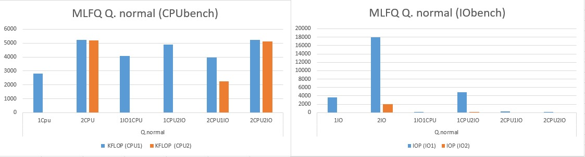
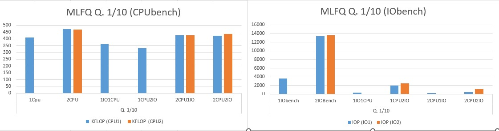
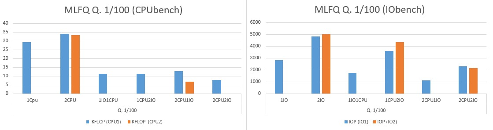
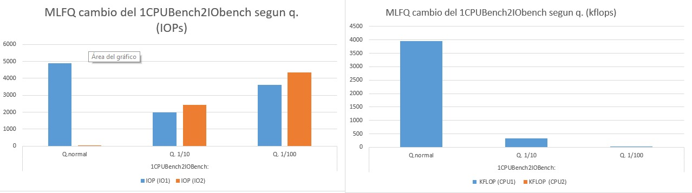
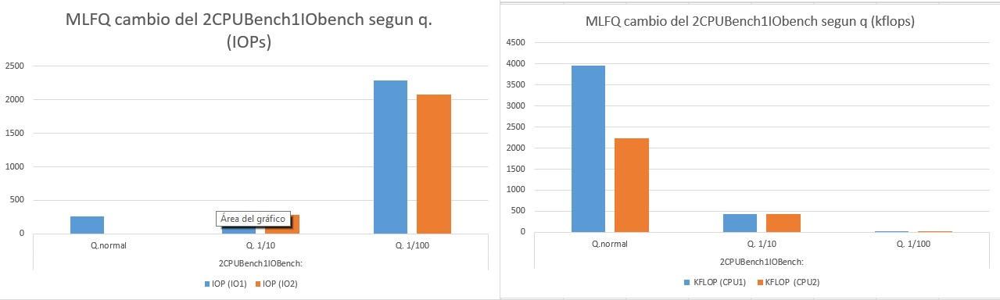

# Informe: Laboratorio 3 #

### Primera Parte: Estudiando el planificador de xv6 ###

#### Preguntas ####
 
• **¿Qué política de planificación utiliza xv6 para elegir el próximo proceso a ejecutarse?**
	
La política de planificación utilizada es Round-Robin, la cual se basa en hacer recorrer todos los procesos que pueden ejecutarse (Marcados con la etiqueta RUNNABLE) y darle acceso a la CPU a cada uno de 	ellos, uno por vez. Para planificar de manera justa, el planificador dedica a cada trabajo un quantum, y lo interrumpe si no fue completado en ese tiempo, este es resumido si la próxima vez se le asigna una franja 
horaria a ese proceso. Si el proceso termina o cambia su estado durante su tiempo atribuido, el planificador elije el próximo proceso en la cola (El siguiente listo para ejecutar).

• **¿Cuanto dura un quantum en xv6?**

 El quantum o time-slot es el tiempo de cpu permitido de un proceso, este está definido como el tiempo que hay entre dos timer interrupts, en otras palabras,
 la frecuencia con la que se realiza un timer interrupt. Este valor esta definido en el archivo start.c, en la funcion timerinit(). Por defecto el valor es 
 1000000 ticks, lo cual es alrededor de 1/10 de segundo.
        	
• **¿El cambio de contexto consume tiempo de un quantum?**

  Si, debido a que los timer interrupt siempre ocurren luego de una cierta cantidad de tiempo, y los el tamaño de quantum esta relacionado con ese intervalo, es inevitable
  que el cambio de contexto consuma una pequeña porcion del quantum de un proceso. De hecho, si los quantums son lo suficientemente pequeños, los procesos no llegan a ejecutarse
  debido a ese tiempo que ocupa el context switch.

• **¿Cuanto tarda un context switch?**

  A partir de la idea anterior, fuimos alterando el tamaño del quantum hasta que llego un punto en el que los procesos no se ejecutaban. De esta manera podemos aproximar el tiempo del
  context switch a un valor entre 50 y 100 ticks.
        
• **¿Hay alguna forma de que a un proceso se le asigne menos tiempo?**

  Si, en el caso que un proceso se deja de ejecutar durante el transcurso de un quantum (Ya sea porque se termino de ejecutar o porque inicia una operacion I/O), si se 
  elige otro proceso para correr, este nuevo proceso se ejecutara hasta que termine el tiempo del quantum desde que se ejecuto el primer proceso, teniendo asi menor tiempo de ejecucion.

### Segunda parte: Cómo el planificador afecta a los procesos ###

Las Mediciones se hicieron dejando correr cada uno de los programas por 5 minutos, y luego se tomaron los promedios de los datos obtenidos.
Vale aclarar que en cada escenario, cada vez que disminuiamos el tiempo del quantum, aumentamos los MINTICKS, asi todos los procesos pueden 
correr la misma cantidad de tiempo.

##### Escenario 0 #####
        
       

      
##### Escenario 1 #####
    

##### Escenario 2 #####
  

##### graficos interesantes #####

       
##### Análisis 
 
  En primer lugar, vale aclarar que las mediciones se vuelven menos exactas. Entre menos tiempo le dabamos de quantum
  mas tiempo hace falta para obtener las mediciones, ya que mas lentos se vuelven los procesos. Por esto, para los ultimos escenarios
  las pocas mediciones que pudimos obtener en 5 minutos indican que se realizan muy pocas operaciones durante ese intervalo.
  Tambien podemos observar que para el quantum normal, cuando hay tanto procesos io-bound como cpu-bound les va mejor a los
  cpu-bound (Por ejemplo en el caso de 2CPUBENCH2IOBENCH, donde uno de los iobench ni siquiera llega a ejecutarse, y el otro realiza pocas
  operaciones). Sin embargo esta relación cambia a medida que vamos disminuyendo el tamaño del quantum, teniendo un mucho mejor rendimiento
  los procesos io-bound para los quantums mas chicos.
  
    
### Tercera Parte: Rastreando la prioridad de los procesos 

Se agregaron los campos prio y times_exec a la estructura proc para la posterior implementacion del MLFQ. Además en la función allocproc() inicializamos
la prioridad de un proceso a su valor máximo (0). 
Como decidimos hacer priority boost; no subimos la prioridad de un proceso aunque este libere el cpu antes del quantum (Esto se realizaria en la funcion sleep(),
ya que es la funcion que se llama cuando esto sucede). Sin embargo lo bajamos de prioridad en la función yield(), la cual se llama cuando ocurre un timer interrupt,
por lo que nos aseguramos que si un proceso consume todo un quantum, baja de prioridad.
Por ultimo se modifico la función procdump() para que imprima la informacion pedida en el enunciado.

### Cuarta Parte: Implementando MLFQ ###

Pasamos por distintas implementaciones que nos produjeron distintas dificultades, entre ellas:

 + Implementamos las colas con arreglos circulares utilizando módulo y nuestra mlfq era un array de esas colas, tuvimos problemas de memoria por los punteros que no supimos entender.

 + Un array bidimensional de NPRIO * NPROC junto con un array que contenia informacion de cada cola, una upla con el primer elemento y el largo de cada una.
   No salió porque nos daba el error panic: kerneltrap.
   
 
Al final nos decidimos a implementarlo sin ninguna estructura de datos. Escojemos el proceso con mayor prioridad y que menos veces se ejecutó recorriendo el array de procesos (Logrando así que si 
dos procesos tienen la misma prioridad se correra en *round-roubin*).
A los procesos que consumen mas cpu, utilizando todo el quantum, los descendemos de prioridad. Para que no se produzca starvation, cada cierta cantidad de ejecuciones se realiza el priority boost, 
seteando el campo prio de cada proceso en 0.
    
Lo que mas costo fue entender como era toda la trayectoria por la que pasaba un poroceso luego de scheduler(), costo entender los traps a kernel y el rol de las funciones yield y sleep.
     

Ahora repitiremos las mediciones Segunda parte para ver las propiedades del nuevo planificador.

##### Escenario 0 #####

##### Escenario 1 #####

##### Escenario 2 #####

##### graficos interesantes #####

##### Análisis 

La mejora no se ve inmediatamente, pero la cantidad de operaciones de los procesos io-bound en cada uno de los quantums aumenta
con respecto al planificador original. Donde mas se nota esta diferencia es en el caso de 1CPU2IO, en el cual antes uno de los iobench
no se ejecutaba y el restante realizaba pocas operaciones, con la implementacion de este MLFQ ahora ambos iobench se ejecutan y uno de ellos
realiza aproximadamente la misma cantidad de operaciones que las que el cpubench indica. Esta mejora del rendimiento de los procesos io-bound 
puede verse a medida que los quantum disminuyen en tamaño. Además, en los quantums mas pequeños los procesos
cpu-bound realizan cada vez menos operaciones. Si bien ocurria este mismo comportamiento con el planificador original, el rendimiento de 
estos procesos disminuye mas rapidamente (Un ejemplo es el caso de 2CPUBENCH2IOBENCH, donde con Round-Robin los procesos cpu-bound seguian 
haciendo mas operaciones pero con nuestro MLFQ a los io-bound les va mejor).

#### ¿Se puede producir starvation en el nuevo planificador? ####

   No, esta implementado mlfq con el priority boost. Por lo que cada cierta cantidad de ejecuciones se reasigna
   la prioridad de cada proceso a 0, y aquellos procesos que se hayan ejecutado menos veces se ejecturán. Aunque 
   tiene el problema de que un proceso que libere siempre el procesador un poco antes, puede mantenerse en 
   la misma prioridad,utilizando el cpu mas tiempo.

